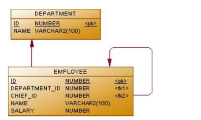

# postgresql_practice
Схема базы данных:



```
Комментарий к схеме:
pk – primary key, уникальный идентификатор таблицы
Fk – foreign key, вторичный ключ для связывания с другой таблицей по pk.
CHEEF_ID – это атрибут содержащий идентификатор сотрудника, который является
руководителем, foreign key на таблицу EMPLOYEE.
```
## Примеры задач и их решение представлено в файле practice_1.sql

